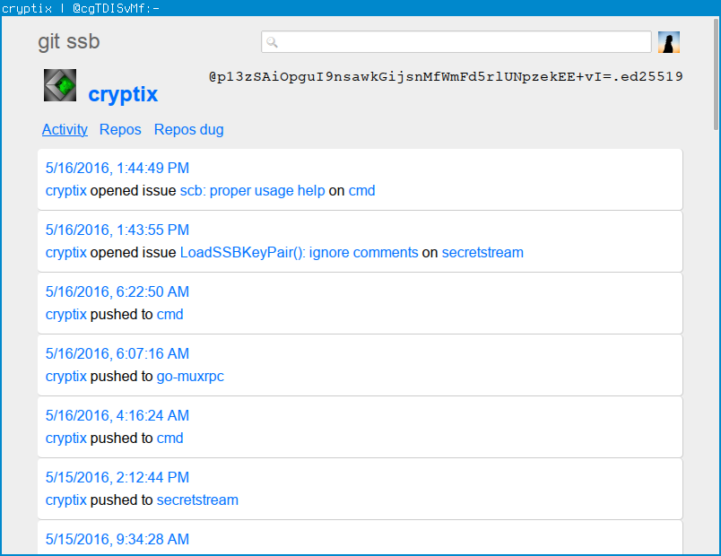
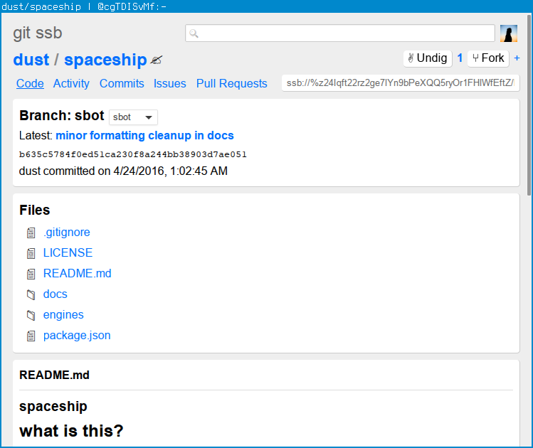
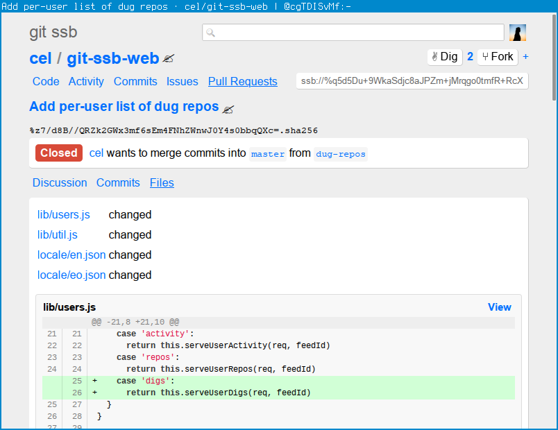

# git-ssb-web

A web interface for git repos on [ssb][secure-scuttlebutt].

Public demo: <https://git-ssb.celehner.com/>

## Install
```
npm install -g git-ssb-web
```

Or, if you also want the git remote helper and other goodies, install the
[git-ssb][] suite:

```
npm install -g git-ssb
```

## Usage

```
git-ssb-web [<options>] [<host:port>]
```
- `host`: hostname to listen on. defaults to `localhost`.
- `port`: port to listen on. defaults to `7718`.

Options:
- `--public`: make the app read-only (e.g. disable making digs), to make it
  suitable for serving publicly

## Screenshots







[secure-scuttlebutt]: https://github.com/ssbc/secure-scuttlebutt
[git-ssb]: %n92DiQh7ietE+R+X/I403LQoyf2DtR3WQfCkDKlheQU=.sha256

## License

Copyright (c) 2016 Charles Lehner

Usage of the works is permitted provided that this instrument is
retained with the works, so that any entity that uses the works is
notified of this instrument.

DISCLAIMER: THE WORKS ARE WITHOUT WARRANTY.
